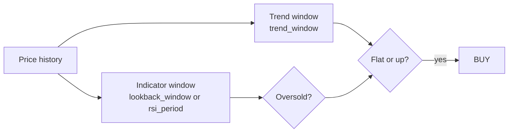

# Dual lookback windows for mean reversion

## Current state

In [`src/strategies/mean_reversion.py`](src/strategies/mean_reversion.py):

- **MeanReversionZScore** / **MeanReversionPct** use `lookback_window` for both z-score/SMA and `_trend_pct`.
- **MeanReversionRSI** uses `rsi_period` for both RSI and trend.

Your [`config.json`](config.json) only sets `lookback_window` (e.g. `25`); trend currently shares that window.

## Target behavior

| Strategy | Indicator window | Trend window |
|----------|------------------|--------------|
| `MeanReversionZScore` | `lookback_window` | `trend_window` |
| `MeanReversionPct` | `lookback_window` | `trend_window` |
| `MeanReversionRSI` | `rsi_period` (unchanged name) | `trend_window` |

Trend logic stays the same: `_trend_pct(prices, trend_window)` and `_trend_allows_entry(...)`.

## Code changes — [`src/strategies/mean_reversion.py`](src/strategies/mean_reversion.py)

### 1. Shared warmup helper

```python
def _min_history_bars(indicator_window: int, trend_window: int, *, rsi: bool = False) -> int:
    indicator_need = indicator_window + 1 if rsi else indicator_window
    return max(indicator_need, trend_window)
```

### 2. Each class `__init__`

Add parameter:

```python
trend_window: int | None = None,
```

Resolve in body (backward compatible):

```python
self.trend_window = trend_window if trend_window is not None else lookback_window
# RSI: default trend_window to rsi_period when omitted
```

Store both in `self.params` for config traceability.

### 3. `on_bar` updates

**ZScore / Pct:**

```python
if len(prices) < _min_history_bars(self.lookback_window, self.trend_window):
    continue
z = _z_score(prices, self.lookback_window)
# ...
trend = _trend_pct(prices, self.trend_window)
```

**RSI:**

```python
if len(prices) < _min_history_bars(self.rsi_period, self.trend_window, rsi=True):
    continue
rsi = _rsi(prices, self.rsi_period)
# ...
trend = _trend_pct(prices, self.trend_window)
```

### 4. Descriptions

Update class `description` strings to mention separate indicator vs trend windows.

No changes to [`scripts/run_backtest.py`](scripts/run_backtest.py) or the engine.

## Config and docs

| File | Change |
|------|--------|
| [`config.example.json`](config.example.json) | Add `"trend_window": 50` (or another value) next to `lookback_window` |
| [`README.md`](README.md) | Strategies table + JSON examples: document `trend_window` for all three; note RSI keeps `rsi_period` |

Example (Z-score / Pct):

```json
"params": {
  "lookback_window": 50,
  "trend_window": 100,
  "entry_z_score": -2.0,
  "exit_z_score": 0.0,
  "max_downward_trend_pct": 1.0,
  "profit_target_pct": 1.0,
  "stop_loss_pct": 2.0
}
```

Example (RSI):

```json
"params": {
  "rsi_period": 14,
  "trend_window": 50,
  "entry_rsi": 30,
  "exit_rsi": 50,
  "max_downward_trend_pct": 1.0
}
```

**User config:** You may add `trend_window` to [`config.json`](config.json) when tuning (e.g. longer trend than indicator). If omitted, behavior matches today (`trend_window` defaults to `lookback_window` / `rsi_period`).

## Validation

Run backtests with explicit windows, e.g. `lookback_window: 25`, `trend_window: 50`:

```bash
uv run python scripts/run_backtest.py
```

Smoke-test all three strategy names; confirm no errors and that entry count changes when `trend_window` differs from the indicator window.


