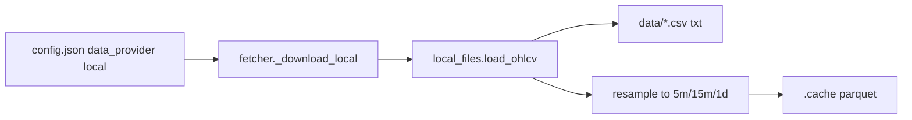

# Local file data provider

## Context

You added intraday files under [`data/`](data/) (gitignored in [`.gitignore`](.gitignore)). The backtest pipeline expects normalized DataFrames from [`src/data/fetcher.py`](src/data/fetcher.py) with columns `open`, `high`, `low`, `close`, `adj_close`, `returns` and a `DatetimeIndex` named `date`.

**Two file formats observed:**

| Pattern | Example | Columns |
|---------|---------|---------|
| CSV with header | `AAPL_1min_firstratedata.csv` | `timestamp,open,high,low,close,volume` |
| TXT no header | `SPX_full_1min.txt`, `DJI_full_1min.txt` | `datetime,open,high,low,close` (no volume) |

All files are **1-minute** bars. Your config `interval: 5m` requires **resampling** (same approach as [`src/data/stockdata.py`](src/data/stockdata.py) `resample_ohlcv`).

**Date coverage:** files span roughly **2022-09-30 → 2023-09-29**. Your current [`config.json`](config.json) asks for **2026-03-01 → 2026-05-27** — backtests will return no rows until dates are adjusted. The plan includes a clear warning when the filtered range is empty.



## Architecture

### 1. New module [`src/data/local_files.py`](src/data/local_files.py)

Responsibilities (short comments per AGENTS.md):

- **`default_data_dir()`** — `project_root()/data` (reuse `project_root()` from [`src/config.py`](src/config.py) or duplicate one-liner to avoid circular imports)
- **`resolve_file(data_dir, ticker) -> Path`** — find file by ticker using ordered patterns:
  1. `{TICKER}_1min_firstratedata.csv`
  2. `{TICKER}_full_1min.txt`
  - Case-insensitive match; skip duplicate names like `SPY_1min_firstratedata 2.csv` (prefer exact pattern without suffix)
  - Clear error if no file found: lists available tickers inferred from directory
- **`load_raw_1min(path) -> pd.DataFrame`** — parse CSV (header) or TXT (no header, assign columns); parse `timestamp` as datetime index
  - TXT files: set `volume=0` when missing
- **`load_ohlcv(ticker, start, end, interval, data_dir)`** — load file, filter to `[start, end]`, resample if `interval != 1m`, normalize
- **Reuse** `normalize_ohlcv` / `resample_ohlcv` from [`src/data/stockdata.py`](src/data/stockdata.py) to avoid duplicating aggregation logic

**Supported intervals:** `1m` (passthrough), `5m`, `15m`, `30m`, `1h`, `1d` — map `1m` as native 1-minute source; resample others from 1m bars.

**Normalization:** `adj_close = close` (unadjusted local data), compute `returns`.

### 2. Extend [`src/data/fetcher.py`](src/data/fetcher.py)

- Add `"local"` to `VALID_PROVIDERS`
- Add `_download_local(ticker, start, end, interval)` calling `local_files.load_ohlcv`
- Dispatch in `_download()` before yfinance fallback
- Existing `.cache/` parquet caching unchanged (important for ~200k-row CSV reads)

### 3. Config

- [`src/config.py`](src/config.py): add `"local"` to `VALID_DATA_PROVIDERS`
- Optional v1 field **`data_dir`** (default `"data"`) on `BacktestConfig` — lets you override folder without code changes; if omitted, defaults to `data/`
- [`config.example.json`](config.example.json): show example:

```json
"data_provider": "local",
"interval": "5m",
"start_date": "2023-01-01",
"end_date": "2023-09-29",
"tickers": ["AAPL", "MSFT"]
```

### 4. Docs

Update [`README.md`](README.md):

| `data_provider` | Source | Intervals | Notes |
|-----------------|--------|-----------|-------|
| `local` | `data/` CSV/TXT files | `1m`, `5m`, `15m`, `30m`, `1h`, `1d` | No API key; resamples from 1m files |

Document filename conventions and available tickers from your current folder (AAPL, MSFT, META, AMZN, TSLA, SPY, QQQ, DIA, EEM, VXX, SPX, DJI, NDX, RUT, VIX). Note `GOOGL` has no local file yet.

### 5. Entry point

[`scripts/run_backtest.py`](scripts/run_backtest.py) — pass optional `data_dir=config.data_dir` into `fetch_ohlcv` if added; otherwise local module uses default `data/`.

## Ticker → file mapping (v1)

Direct filename match only (no alias map):

- `AAPL` → `AAPL_1min_firstratedata.csv`
- `SPX` → `SPX_full_1min.txt`
- `DJI` → `DJI_full_1min.txt` (separate from `DIA_1min_firstratedata.csv`)

## Verification

1. `data_provider: local`, `tickers: ["AAPL"]`, dates within 2022–2023, `interval: 5m` — loads, resamples, caches, backtest runs
2. Missing ticker file (e.g. `GOOGL`) — clear error listing available symbols
3. Date range outside file coverage — warn + empty result (no silent partial wrong-year data)
4. TXT index file (e.g. `SPX`) parses without volume column
5. Other providers (`yfinance`, `alpaca`) unchanged

## Out of scope (v1)

- Auto-download / sync from FirstRateData
- Ticker alias map in config (can add later)
- Committing large `data/` files (stays gitignored)
