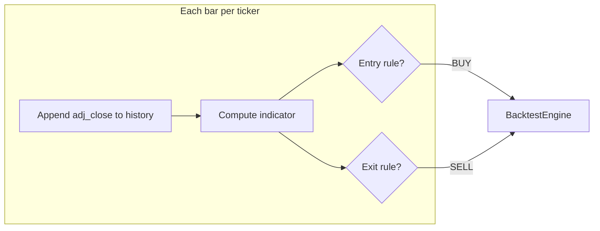

# Mean reversion (regression to the mean) strategies

## Context

Strategies plug into the existing event loop via [`src/strategies/base.py`](src/strategies/base.py) (`on_bar` → `Signal` list) and are selected from [`config.json`](config.json) through [`scripts/run_backtest.py`](scripts/run_backtest.py)’s `STRATEGY_MAP`. Existing examples ([`sma_crossover.py`](src/strategies/sma_crossover.py), [`sma_crossover_tp.py`](src/strategies/sma_crossover_tp.py)) show the pattern:

- Per-ticker rolling price history (`list[float]`)
- Warmup: skip signals until `len(prices) >= required_window`
- Long-only: `BUY` on entry, `SELL` with `quantity=-1` to flatten
- Human-readable `description` on each class
- Tunable params only via `config.json` → `strategy.params`

No engine changes are required; all three variants fit the current `BUY`/`SELL` model.



## Implementation

### New module: [`src/strategies/mean_reversion.py`](src/strategies/mean_reversion.py)

Three classes in one file (related logic, shared helpers):

| Class | Config name | Entry | Exit |
|-------|-------------|-------|------|
| `MeanReversionZScore` | `MeanReversionZScore` | z-score &lt; `entry_z_score` (default `-2.0`) | z-score ≥ `exit_z_score` (default `0.0`) |
| `MeanReversionPct` | `MeanReversionPct` | price ≤ SMA × (1 + `entry_pct` / 100) (default `entry_pct: -2.0`) | price ≥ SMA (reverted to mean) |
| `MeanReversionRSI` | `MeanReversionRSI` | RSI ≤ `entry_rsi` (default `30`) | RSI ≥ `exit_rsi` (default `50`) |

**Shared helpers** (private functions at top of file):

- `_rolling_mean(prices, window) -> float`
- `_z_score(prices, window) -> float | None` — return `None` if std == 0
- `_rsi(prices, period) -> float | None` — Wilder-smoothed RSI (standard 14-period default); needs `period + 1` prices minimum

**Shared instance state** (per class, same as SMA strategies):

- `_price_history: dict[str, list[float]]`
- `_in_position: set[str]`
- `_entry_price: dict[str, float]` (for optional stop-loss)

**Optional stop-loss** (all three): if `stop_loss_pct` is set (e.g. `2.0`), exit when unrealised loss exceeds that percent — mirrors [`sma_crossover_tp.py`](src/strategies/sma_crossover_tp.py) profit check but inverted. Default: `None` (disabled) so pure mean-reversion exits drive behavior unless configured.

**Descriptions** (required by project rules), e.g.:

- Z-score: “Regression to the mean using z-score — buys when price is unusually far below the rolling mean (oversold), sells when it reverts toward the mean.”
- Pct: “…when price deviates X% below a rolling SMA…”
- RSI: “…when RSI is oversold, sells when RSI normalizes…”

### Wire-up: [`scripts/run_backtest.py`](scripts/run_backtest.py)

Import the three classes and extend `STRATEGY_MAP`:

```python
from src.strategies.mean_reversion import (
    MeanReversionZScore,
    MeanReversionPct,
    MeanReversionRSI,
)

STRATEGY_MAP = {
    ...
    "MeanReversionZScore": MeanReversionZScore,
    "MeanReversionPct": MeanReversionPct,
    "MeanReversionRSI": MeanReversionRSI,
}
```

### Config examples

Update [`config.example.json`](config.example.json) with one documented default (Z-score) and add a short **Strategies** subsection to [`README.md`](README.md) listing all three `name` values and their `params` so you can A/B test without code changes.

Example blocks for README (not all in `config.example.json`):

**Z-score** (good default for 15m bars):

```json
"strategy": {
  "name": "MeanReversionZScore",
  "params": {
    "lookback_window": 50,
    "entry_z_score": -2.0,
    "exit_z_score": 0.0
  }
}
```

**Percent deviation:**

```json
"strategy": {
  "name": "MeanReversionPct",
  "params": {
    "lookback_window": 50,
    "entry_pct": -2.0
  }
}
```

**RSI:**

```json
"strategy": {
  "name": "MeanReversionRSI",
  "params": {
    "rsi_period": 14,
    "entry_rsi": 30,
    "exit_rsi": 50
  }
}
```

Do **not** change your live [`config.json`](config.json) unless you want to switch away from `SMACrossoverTakeProfit`; only template/docs get the new examples.

### Validation

After implementation, run three quick backtests (same tickers/dates, swap `strategy.name`):

```bash
uv run python scripts/run_backtest.py
```

Compare equity curve / metrics in `output/equity_curve.csv` across `MeanReversionZScore`, `MeanReversionPct`, and `MeanReversionRSI`. Expect a long warmup period on 15m data when `lookback_window` is 50 (same order of magnitude as your SMA settings).

## Design notes

- **Long-only**: “Regression up” after oversold conditions; no shorting (engine unchanged).
- **Per-ticker independence**: Each symbol maintains its own history and position flag, consistent with multi-ticker SMA runs.
- **NaN bars**: Skip tickers where `adj_close` is NaN (same guard as SMA strategies).
- **No new dependencies**: Pure Python math on price lists; no pandas rolling inside strategies.
- **No unit tests** in repo today; manual backtest comparison is the acceptance check unless you want tests added later.

## Files touched

| File | Change |
|------|--------|
| `src/strategies/mean_reversion.py` | **New** — three strategy classes + helpers |
| `scripts/run_backtest.py` | Register in `STRATEGY_MAP` |
| `config.example.json` | Example `MeanReversionZScore` block |
| `README.md` | Document all three strategy names and params |
