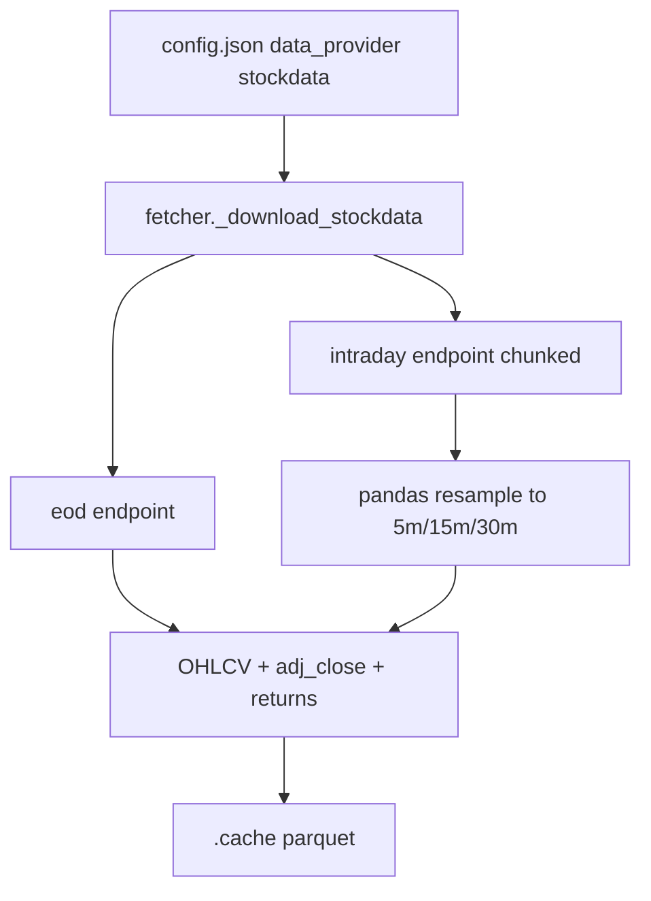

# StockData.org provider integration

## Context

The project already has a provider pattern in [`src/data/fetcher.py`](src/data/fetcher.py) (`yfinance`, `alphavantage`) and config-driven selection via [`config.json`](config.json) / [`src/config.py`](src/config.py). You want **intraday** support from [StockData.org](https://www.stockdata.org/documentation).

Your choices:
- Env var: **`STOCKS_DATA_API_KEY`** (already in [`.env`](.env))
- Intraday endpoint: **unadjusted** [`GET /v1/data/intraday`](https://www.stockdata.org/documentation) (all plans)

**Note:** [`config.json`](config.json) currently has invalid JSON (`//` comment on line 6). Fix that while updating `data_provider` options.

## API constraints (drive implementation)

| Config `interval` | StockData API | Max range per request | Implementation |
|-------------------|---------------|----------------------|----------------|
| `1d` | `/v1/data/eod` (`interval=day`) | ~180 days (per docs meta) | Single or chunked requests by date window |
| `5m`, `15m`, `30m` | `/v1/data/intraday` (`interval=minute`) | **7 days** | Fetch 1-min bars in 7-day chunks, **resample** to target interval |
| `1h` | `/v1/data/intraday` (`interval=hour`) OR resample from minute | 180 days (hour) / 7 days (minute) | Prefer `interval=hour` when range > 7 days; else minute + resample |

StockData returns **1-minute** (or 1-hour) bars, not native 5m. Resampling in pandas keeps your existing `"interval": "5m"` config working.

Your current range (`2026-04-01` → `2026-05-27`, ~57 days at 5m) implies **~9 intraday API calls per ticker** — existing parquet cache in `.cache/` is important.

## Architecture

### 1. New module [`src/data/stockdata.py`](src/data/stockdata.py)

Mirror [`src/data/alphavantage.py`](src/data/alphavantage.py) style (modular client, short comments per AGENTS.md):

- `BASE_URL = "https://api.stockdata.org/v1/data"`
- `get_api_token()` — read `STOCKS_DATA_API_KEY` from env; clear error if missing
- `fetch_intraday(symbol, date_from, date_to, api_interval="minute")` — call `/intraday` with `api_token`, `symbols`, `date_from`, `date_to`, `sort=asc`
- `fetch_eod(symbol, date_from, date_to)` — call `/eod` for daily bars
- `_chunk_date_ranges(start, end, max_days)` — split ranges (7 for minute, 180 for hour/eod per docs)
- `_parse_bars(payload) -> pd.DataFrame` — flatten `data[]` entries (`date`, nested `data.open/high/low/close/volume`) to indexed DataFrame
- `normalize_ohlcv(df)` — set `adj_close = close` (unadjusted), compute `returns`, index name `date`
- `resample_ohlcv(df, interval)` — map `5m`→`5min`, `15m`→`15min`, etc.; OHLC agg + volume sum
- Error handling: empty `data`, HTTP errors, JSON error messages in response body

### 2. Extend [`src/data/fetcher.py`](src/data/fetcher.py)

- Add `"stockdata"` to `VALID_PROVIDERS`
- `_download_stockdata(ticker, start, end, interval)`:
  - `1d` → `fetch_eod` + filter to `[start, end]`
  - intraday intervals → chunked `fetch_intraday` + concat + resample + filter
- Keep yfinance / alphavantage paths unchanged
- Optional: lightweight throttle between chunk requests if needed (start without unless rate-limit errors appear)

### 3. Config and env

- [`src/config.py`](src/config.py): add `"stockdata"` to `VALID_DATA_PROVIDERS`
- [`config.example.json`](config.example.json): document `"data_provider": "stockdata"` with comment in README (not in JSON)
- [`.env.example`](.env.example): add `STOCKS_DATA_API_KEY=your_token_here`
- Fix [`config.json`](config.json): remove `//` comment; user can set `"data_provider": "stockdata"` when ready

No new required keys in `config.json` for v1 (token from `.env` only). Optional later: `extended_hours` bool if you want pre/post market.

### 4. Docs

Update [`README.md`](README.md) provider table:

| `data_provider` | Intraday | Daily | Env var |
|-----------------|----------|-------|---------|
| `stockdata` | Yes (1m/1h from API; resample to 5m/15m/30m) | Yes (EOD) | `STOCKS_DATA_API_KEY` |

Document 7-day chunking for minute data and US-listed symbols only (IEX-sourced per StockData docs).

### 5. Entry point

[`scripts/run_backtest.py`](scripts/run_backtest.py) already calls `load_dotenv()` and `fetch_ohlcv(..., provider=config.data_provider)` — no structural change needed beyond provider wiring.

## Interval support matrix (after implementation)

| `interval` | `yfinance` | `alphavantage` (free) | `stockdata` |
|------------|------------|----------------------|-------------|
| `1d` | Yes | Yes (~100 bars) | Yes (EOD, chunked) |
| `5m`, `15m`, `30m` | Yes | No | Yes (1m + resample) |
| `1h` | Yes | No | Yes |

## Verification

1. `data_provider: yfinance`, `interval: 5m` — existing backtest unchanged
2. `data_provider: stockdata`, `interval: 5m`, 1 ticker, short range (≤7 days) — fetch, cache, run backtest
3. Same with 57-day range — multiple chunks, concatenated correctly
4. Missing `STOCKS_DATA_API_KEY` with `stockdata` — clear error before HTTP
5. Invalid `config.json` (comment removed) — `BacktestConfig.load()` succeeds

## Out of scope (v1)

- Adjusted intraday (`/intraday/adjusted`) — can add config flag later if you upgrade plan
- News / sentiment endpoints
- Auto-fallback to yfinance on StockData errors
