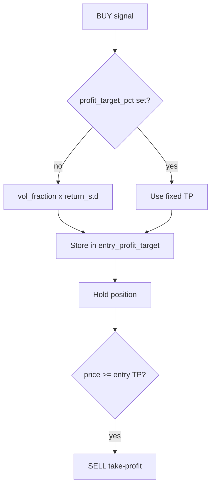

# Volatility-based take profit for mean reversion

## Goal

When `profit_target_pct` is **not** set in [`config.json`](config.json), compute take-profit as:

```text
profit_target = profit_vol_fraction × rolling_volatility_pct
```

Where rolling volatility is the **standard deviation of bar-to-bar % returns** over `volatility_window` (user-selected: return std).

If `profit_target_pct` **is** set (e.g. your current `0.5`), use that fixed value and ignore volatility.

## Behavior contract

| Config | Take-profit |
|--------|----------------|
| `profit_target_pct` omitted / `null` | `profit_vol_fraction × vol%` at entry |
| `profit_target_pct: 0.5` | Fixed 0.5% (override) |
| Computed TP ≤ 0 or vol unavailable | No take-profit for that trade |

Lock the resolved TP **at entry** in `_entry_profit_target[ticker]` so the target does not drift bar-to-bar.

Exit order unchanged: stop-loss → take-profit → signal exit.

## Code — [`src/strategies/mean_reversion.py`](src/strategies/mean_reversion.py)

### New helpers

```python
def _rolling_return_vol_pct(prices: list[float], window: int) -> float | None:
    """Std dev of bar-to-bar % returns over the last `window` returns."""
    # needs len(prices) >= window + 1
    returns = [(prices[i] / prices[i - 1] - 1) * 100 for i in range(-window, 0)]
    ...


def _resolve_profit_target_pct(
    fixed_pct: float | None,
    prices: list[float],
    volatility_window: int,
    profit_vol_fraction: float,
) -> float | None:
    if fixed_pct is not None:
        return fixed_pct
    vol = _rolling_return_vol_pct(prices, volatility_window)
    if vol is None or vol <= 0:
        return None
    target = profit_vol_fraction * vol
    return target if target > 0 else None
```

### Warmup

Extend `_min_history_bars` with optional `volatility_window` (needs `window + 1` prices). Pass it from all three strategies so vol is valid before first entry.

### Shared state (all three classes)

- Add `volatility_window: int = 20`
- Add `profit_vol_fraction: float = 1.0`
- Keep `profit_target_pct: float | None = None` as override
- Add `_entry_profit_target: dict[str, float]`

### Entry (on BUY)

```python
tp = _resolve_profit_target_pct(
    self.profit_target_pct, prices, self.volatility_window, self.profit_vol_fraction
)
self._entry_profit_target[ticker] = tp  # only if tp is not None, or store None
```

### Exit

Change `_exit_if_risk_targets` to accept `profit_target_pct` from `_entry_profit_target.get(ticker)` instead of `self.profit_target_pct`. Clear `_entry_profit_target` on any exit (SL, TP, signal).

### Descriptions

Update class `description` strings to mention volatility-based default TP.

No engine or `STRATEGY_MAP` changes.

## Config and docs

New params (all three mean-reversion strategies):

| Param | Default | Role |
|-------|---------|------|
| `volatility_window` | `20` | Bars for return-vol estimate |
| `profit_vol_fraction` | `1.0` | Multiplier on vol% for TP |
| `profit_target_pct` | `null` | Fixed override when set |

Update [`config.example.json`](config.example.json) and [`README.md`](README.md): show vol-based default (omit `profit_target_pct`), document override and the two new keys.

Do **not** change your live [`config.json`](config.json) — your explicit `"profit_target_pct": 0.5` will keep working as an override.

Example (vol-based default):

```json
"params": {
  "lookback_window": 50,
  "trend_window": 100,
  "volatility_window": 20,
  "profit_vol_fraction": 1.5,
  "stop_loss_pct": 2.0
}
```

Example (fixed override — current style):

```json
"profit_target_pct": 0.5,
"volatility_window": 20,
"profit_vol_fraction": 1.5
```



## Validation

1. Backtest with `profit_target_pct` omitted → trades use varying TP; no errors.
2. Backtest with your existing `profit_target_pct: 0.5` → behavior unchanged vs before.
3. Compare trade count / exits when `profit_vol_fraction` is `1.0` vs `2.0`.

```bash
uv run python scripts/run_backtest.py
```
